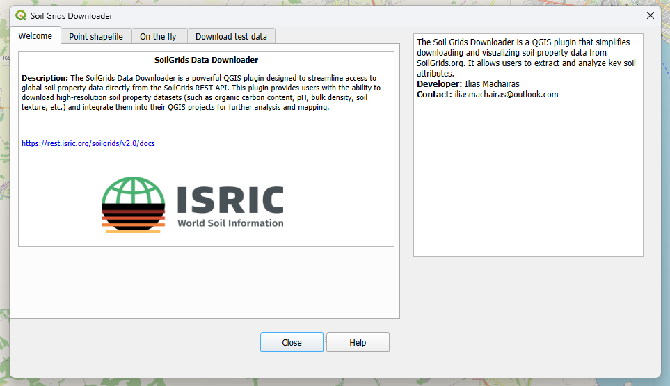

# 🌱 Soil Grids Downloader
Version: 0.1 (Initial Release)
Compatible with QGIS 3.x and above

The **Soil Grids Downloader** is a **QGIS plugin** designed to simplify the process of downloading and visualizing soil properties derived from [SoilGrids.org](https://soilgrids.org).  
It enables users to extract soil attributes such as **clay**, **sand**, **silt**, **soil organic carbon (SOC)**, and **nitrogen content** for specific points or shapefile datasets — all within QGIS.

---

## 🌍 Key Features

### 🧩 Soil Properties for Shapefile of Points
- Select an existing shapefile with **point geometry** (projection **EPSG:4326 – WGS 84**).  
- Retrieve and attach soil properties (clay, sand, silt, SOC, nitrogen) to each point.  
- The output shapefile includes new fields representing the selected soil properties.

### 🗺️ On-the-Fly Soil Properties
- Click on the QGIS map to select a location and automatically view soil data.  
- The projection crs should be 4326
- Quickly copy results to clipboard with a single button.

### 🧪 Accessing Test Data
- Includes preloaded test data for quick demonstration and exploration.
---

## ⚙️ Installation

1. Open **QGIS**.  
2. Navigate to **Plugins → Manage and Install Plugins**.  
3. Search for **"Soil Grids Downloader"**.  
4. Click **Install Plugin**.  

✅ No additional installations or dependencies are required — just install and start using.

---

## 📊 Supported Soil Properties

Currently supported soil attributes (depth range: **5–15 cm**):

- Clay content  
- Sand content  
- Silt content  
- Soil Organic Carbon (SOC)  
- Nitrogen content  

> Future versions will expand the available properties and depth ranges.

---

## 🚦 Fair Use Policy and Limitations

The plugin retrieves data via the **SoilGrids REST API**, which enforces a **Fair Use Policy**:

- **Limit:** Up to **5 API calls per minute**  
- Exceeding this limit may cause temporary **delays** or **processing errors**  
- Recommended for **moderate workloads** and **small datasets**

Both the **Soil Grids Downloader** and the **SoilGrids API** are currently in **beta**, meaning:
- Occasional downtime or performance issues may occur  
- Compatibility with future versions of the API or plugin is not guaranteed  

Despite these limitations, the plugin provides a solid foundation for soil data exploration and analysis.

---

## 🧩 Development & Maintenance

This is the **first demo version** of the plugin.  
Ongoing development will focus on:
- Supporting more soil properties and depth ranges  
- Improving UI responsiveness and data handling  
- Enhancing API communication and error reporting  

Contributions, feedback, and issue reports are highly encouraged to improve future releases.

---

📘 **Full documentation is available on [Read the Docs](https://soilgrids-downloader-qgis-plugin.readthedocs.io/en/latest/)** for detailed usage instructions, examples, and developer guidelines.

---

## 📜 License

This project is released under an **open-source license**.  
You may freely use, modify, and share the plugin in accordance with the provided license terms.

---

## 📬 Contact

For feedback, bug reports, or feature requests:
- Open an issue in this repository, or  
- Contact the developer via the **QGIS Plugin Repository** page.

---

**© Soil Grids Downloader – QGIS Plugin | Version 1.0 (Demo Release)**
