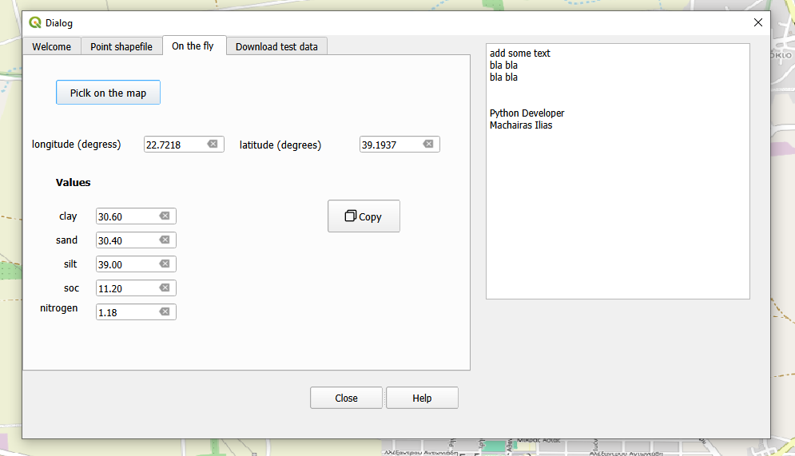

.. Soil_grids_downloader documentation master file, created by
   sphinx-quickstart on Wed Nov 27 00:37:35 2024.
   You can adapt this file completely to your liking, but it should at least
   contain the root `toctree` directive.

Welcome to Soil_grids_downloader's documentation!
=================================================

The **Soil Grids Downloader** is a QGIS plugin designed to streamline the process of downloading and visualizing soil properties data derived from `soilgrids.org`_ .
Users can extract soil attributes such as clay, sand, silt, soil organic carbon (SOC), and nitrogen content, for specific points or shapefile datasets.
The plugin supports multiple functionalities including coordinate selection, property filtering, and shapefile generation.

.. _soilgrids.org: https://soilgrids.org

This is the first demo version of the QGIS plugin, and currently, only a limited number of soil properties are available for use.
These properties are applicable to a specific depth range of 5 to 15 centimeters.

Key Features:
--------------
- **Soil properties for shapefile of points**
- **Accessing Test Data**
- **On the fly - soil properties**

.. toctree::
   :maxdepth: 2
   :caption: Contents:

   installation
   functionality
   api_reference
   troubleshooting

Installation
============

Regarding installation instructions you just need to download then install the plugin from QGIS repository for free. 
There is no need to install anything more than that

Soil properties for shapefile of points
======================

This functionality enables users to select an already existing shapefile with point geometry whose projection
is epsg: 4326 (WGS 84) and update it with the soil properties of the points. Users can specify which soil properties
to include in the output, such as clay, sand, and silt, as clay, sand, and silt, SOC, adn nitrogen. When generating the output file,
users can define the save location and if teh output shapefile will  be loaded on QGIS canvas. 
The output file will include additional fields reflecting the selected soil properties.

Fair Use Policy - Limitations
======================

The plugin relies on the SoilGrids REST API to retrieve soil data. The API is subject to a Fair Use Policy, allowing a maximum of 5
calls per minute. Exceeding this limit may cause processing delays or temporary errors. Users should be mindful of this constraint,
particularly when handling large datasets or performing multiple queries in quick succession. As the plugin and the SoilGrids REST
API are both under active development in their beta stage, users may encounter occasional issues, including downtime or delays.
Compatibility with future versions of the API or plugin cannot be guaranteed at this time. Despite these limitations, the plugin provides
a robust foundation for exploring and analyzing soil data, with continuous improvements expected in subsequent updates.

Accessing Test Data
==================

To facilitate a seamless introduction and quick walkthrough of the plugin, preloaded test data is made available for users.
This data enables users to familiarize themselves with the plugin's features and functionality without requiring immediate external data input.

On the fly - soil properties
==================

The application allows users to interact with a map interface to select specific geographical locations. Upon selection,
relevant soil properties are automatically populated in designated fields within the application. The interface displays
the geographical latitude and longitude of the selected location and enforces strict adherence to the EPSG:4326 coordinate
reference system (CRS). If the selected projection does not match EPSG:4326, an error message will alert the user.

Another functionality is that the user may quickly copy the selected data to the clipboard we're pressing the corresponding button

Developmenet - Maintenance
==================

Ilias Machairas
iliasmacheiras@outlook.com

* :ref:`genindex`
* :ref:`modindex`
* :ref:`search`
